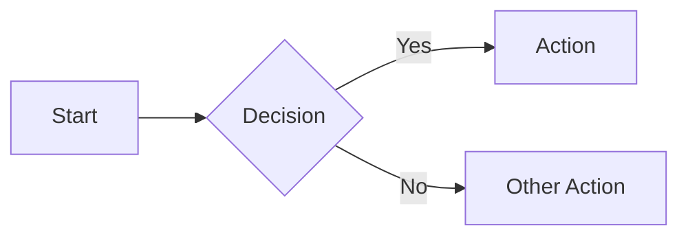
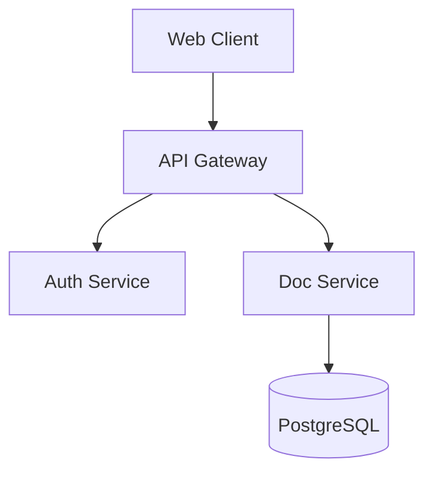
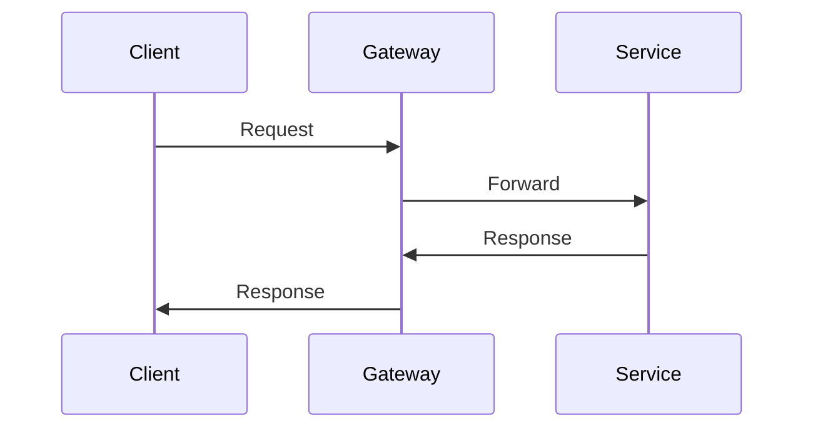

# Emberflow Document Publisher

Create a polished markdown document and publish it to Emberflow — a hosted viewer at **https://supportive-forgiveness-production.up.railway.app** with Mermaid diagram rendering (zoom/pan/fullscreen), dark mode, font selection, and per-block commenting.

## Step 1: Create the Markdown File

Write a `.md` file in the current project. The document should follow these conventions:

### Structure
- Start with a single `# Title` as the first line (this becomes the document title and slug)
- Use `##` and `###` for sections — these become commentable blocks in the viewer
- Keep paragraphs concise — each paragraph, list, table, blockquote, and heading is independently commentable by readers

### Mermaid Diagrams

Use fenced code blocks with the `mermaid` language tag. The viewer renders them with zoom, pan, and fullscreen controls.

````markdown

````

Supported diagram types:
- `graph` / `flowchart` — flow diagrams (LR, TD, etc.)
- `sequenceDiagram` — interaction sequences
- `classDiagram` — class relationships
- `stateDiagram-v2` — state machines
- `erDiagram` — entity relationships
- `gantt` — project timelines
- `pie` — pie charts
- `gitgraph` — git branch visualizations
- `mindmap` — mind maps
- `timeline` — chronological events

#### Dark Mode Color Palette

The viewer auto-remaps these light colors to dark equivalents. Use them for best cross-theme rendering:

| Color | Use For |
|---|---|
| `#e1f5fe` | Blue backgrounds |
| `#e8f5e9` | Green backgrounds |
| `#fff3e0` | Orange backgrounds |
| `#fce4ec` | Red backgrounds |
| `#f3e5f5` | Purple backgrounds |
| `#fff9c4` | Yellow backgrounds |

### Tables, Code, Blockquotes

Standard GFM (GitHub Flavored Markdown) is fully supported:

```markdown
| Column A | Column B |
|----------|----------|
| value    | value    |

> Blockquotes render with a blue left border

`inline code` and fenced code blocks with syntax highlighting
```

### Example Document

````markdown
# API Architecture Overview

Brief introduction to the system.

## Components



## Request Flow



## Data Model

| Entity | Purpose |
|--------|---------|
| Users | Account management |
| Documents | Published content |
| Comments | Discussion threads |

## Design Notes

> We chose event sourcing to maintain a complete audit trail of all state changes.
````

## Step 2: Authenticate (if needed)

Session tokens are stored at `~/.emberflow/token.json`. Check if a valid session exists:

```bash
cat ~/.emberflow/token.json 2>/dev/null
```

If the file exists, verify the token still works:

```bash
curl -s -H "Authorization: Bearer $(jq -r .token ~/.emberflow/token.json)" \
  https://supportive-forgiveness-production.up.railway.app/api/docs
```

If no session exists, it's expired, or the verify call returns 401, authenticate using the device flow:

```bash
EMBERFLOW_URL="https://supportive-forgiveness-production.up.railway.app"

# Step 1: Request a device code
RESP=$(curl -s -X POST "$EMBERFLOW_URL/api/device-code")
CODE=$(echo "$RESP" | jq -r .code)
URL=$(echo "$RESP" | jq -r .verification_url)
```

Tell the user to open the URL in their browser to sign in and approve the device. Then poll until approved:

```bash
# Step 2: Poll until approved (every 3s)
while true; do
  STATUS=$(curl -s "$EMBERFLOW_URL/api/device-code/$CODE")
  S=$(echo "$STATUS" | jq -r .status)
  if [ "$S" = "approved" ]; then
    TOKEN=$(echo "$STATUS" | jq -r .session_token)
    mkdir -p ~/.emberflow
    echo "{\"token\":\"$TOKEN\"}" > ~/.emberflow/token.json
    break
  fi
  if [ "$S" = "expired" ]; then
    echo "Code expired. Please try again."
    break
  fi
  sleep 3
done
```

## Step 3: Publish

Generate a slug from the document title and publish using the API:

```bash
# Read the file, extract title, generate slug, and publish
EMBERFLOW_URL="https://supportive-forgiveness-production.up.railway.app"
FILE_PATH="/absolute/path/to/document.md"
TITLE=$(head -1 "$FILE_PATH" | sed 's/^#\s*//')
SLUG=$(echo "$TITLE" | tr '[:upper:]' '[:lower:]' | tr -cs 'a-z0-9' '-' | sed 's/^-//;s/-$//')
TOKEN=$(jq -r .token ~/.emberflow/token.json)

curl -s -X POST "$EMBERFLOW_URL/api/docs" \
  -H 'Content-Type: application/json' \
  -H "Authorization: Bearer $TOKEN" \
  -d "$(jq -n --arg slug "$SLUG" --arg title "$TITLE" --rawfile content "$FILE_PATH" \
    '{slug: $slug, title: $title, content: $content, visibility: "public"}')"
```

The response JSON includes the URL. Documents are viewable at:
- Public: `https://supportive-forgiveness-production.up.railway.app/d/<shortId>/<slug>`

To **update** an existing document, publish again with the same slug — the API upserts for the same author.

### Other Operations

```bash
# List all your documents
curl -s -H "Authorization: Bearer $TOKEN" "$EMBERFLOW_URL/api/docs"

# Delete a document
curl -s -X DELETE -H "Authorization: Bearer $TOKEN" "$EMBERFLOW_URL/api/docs/<shortId>/<slug>"
```
